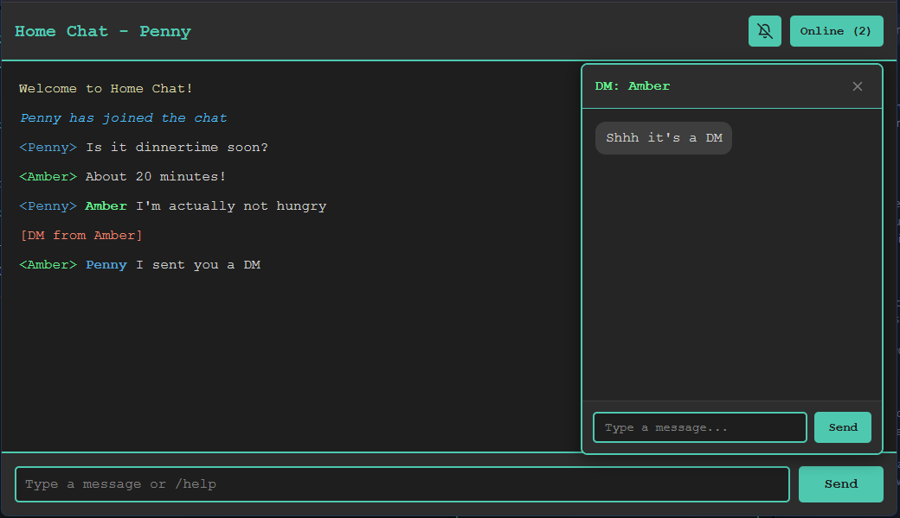

# Home Chat

Home Chat is a small chatroom app for local household use. Run it on a Raspberry Pi or any always-on machine in your house, then open it from browsers on your local network.



## Features

- browser-based chat for anyone on your home network
- direct messages in a side panel
- public `@username` mentions
- notification sounds for DMs, mentions, chat, and system events
- `/ascii <name>` for built-in ASCII art
- `/qotd` for a shared quote of the day
- invite-only After Dark mode with admin-controlled access
- bundled terminal client

Current ASCII art includes `kiss`, `hug`, and `pikachu`.

Current sound themes include `fard`. That's it. It only makes fart sounds.

## Setup

You need Node.js and npm on the machine hosting the app.

```bash
npm install
```

## Start The Server

```bash
npm start
```

The app listens on port `3010`.

If you want After Dark enabled, also set an admin password. Don't tell the kids!

Mac/Linux:

```bash
AFTERDARK_ADMIN_PASSWORD=your-secret-password npm start
```

Windows cmd:

```cmd
set AFTERDARK_ADMIN_PASSWORD=your-secret-password && npm start
```

Windows PowerShell:

```powershell
$env:AFTERDARK_ADMIN_PASSWORD="your-secret-password"; npm start
```

If no admin password is set, After Dark is disabled.

## Open It Around The House

From other devices on the same network, open the server by hostname or IP.

Examples:

- `http://raspberrypi.local:3010`
- `http://home.local:3010`
- `http://192.168.1.50:3010`

This app is meant for local-network use, not for being exposed directly to the public internet.

## Main Commands

- `@username` mention someone publicly
- `/nick <name>` change nickname
- `/me <action>` send an emote
- `/who` show online users
- `/qotd` post a quote of the day
- `/ascii <name>` share ASCII art
- `/kick <user>` kick a user
- `/help` show help
- `/exit` leave chat
- `/dark` enter After Dark if you already have access
- `/dark <password>` log in as an After Dark admin
- `/home` return to Home Chat
- `/invite <user>` invite someone to After Dark
- `/revoke <user>` remove someone's After Dark access

## Terminal Client

There is also a terminal client in `client.js`.

Same machine as the server:

```bash
node client.js
```

Remote machine on your home network:

Mac/Linux:

```bash
HOMECHAT_SERVER=home.local:3010 node client.js
```

Windows cmd:

```cmd
set HOMECHAT_SERVER=home.local:3010 && node client.js
```

You can also use a full URL such as `http://home.local:3010`.

## Running as a System Service (Raspberry Pi)

For an always-on Pi the recommended way to manage the server is **systemd** — it's already on Raspbian, uses no extra RAM, and handles autostart on boot.

### 1. Create a private env file for Home Chat

Use a dedicated file instead of `/etc/environment` so the password is not globally exposed:

```bash
sudo install -d -m 700 /etc/homechat
sudo sh -c 'printf "AFTERDARK_ADMIN_PASSWORD=%s\n" "your-secret-password" > /etc/homechat/homechat.env'
sudo chown root:root /etc/homechat/homechat.env
sudo chmod 600 /etc/homechat/homechat.env
```

### 2. Create the service file

Create `/etc/systemd/system/homechat.service`:

```ini
[Unit]
Description=homeChat
After=network.target

[Service]
ExecStart=/usr/bin/env node /opt/homeChat/server.js
WorkingDirectory=/opt/homeChat
Restart=on-failure
RestartSec=5
User=pi
EnvironmentFile=/etc/homechat/homechat.env

[Install]
WantedBy=multi-user.target
```

If `node` is not found by systemd, replace `ExecStart` with an absolute path from `which node` (for example `/usr/bin/node` or `/usr/local/node20/bin/node`). Also replace `/opt/homeChat` with your app path, and `pi` with your username.

### 3. Enable and start

```bash
sudo systemctl daemon-reload
sudo systemctl enable homechat
sudo systemctl start homechat
```

### Useful commands

| Task           | Command                           |
| -------------- | --------------------------------- |
| Check status   | `systemctl status homechat`       |
| View live logs | `journalctl -u homechat -f`       |
| Restart        | `sudo systemctl restart homechat` |
| Stop           | `sudo systemctl stop homechat`    |

## Notes

- the browser client is the main polished experience
- the terminal client supports chat, private messages, quotes, ASCII art, and After Dark, but its DM flow is command-line based
- quote of the day depends on the ZenQuotes API
